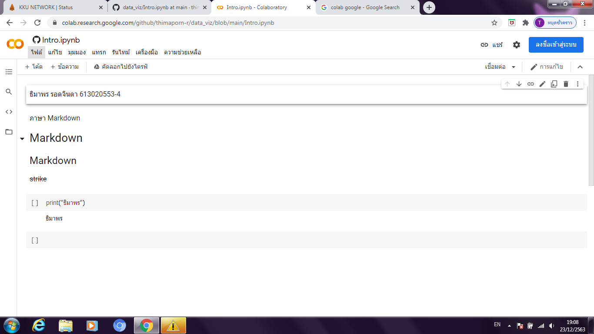
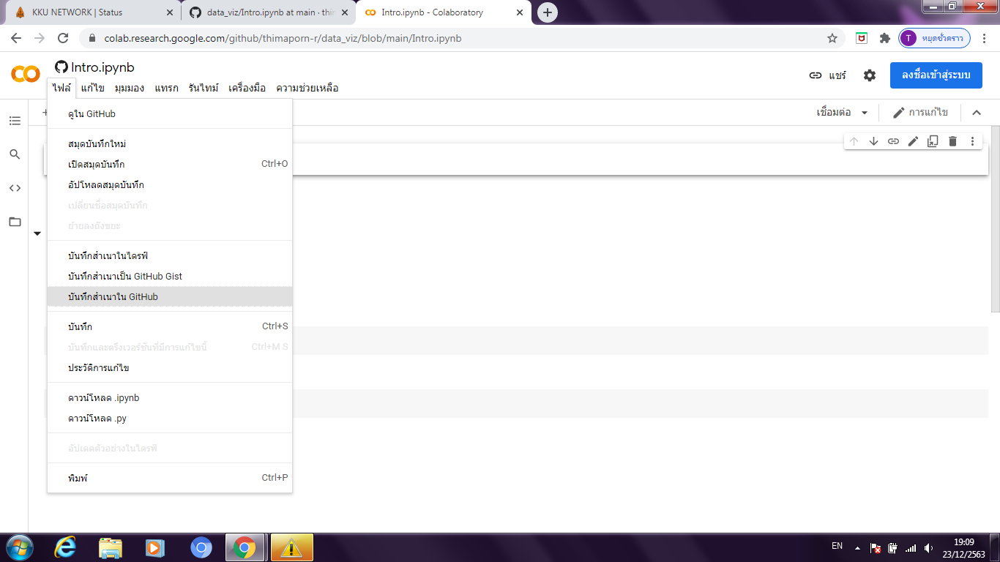
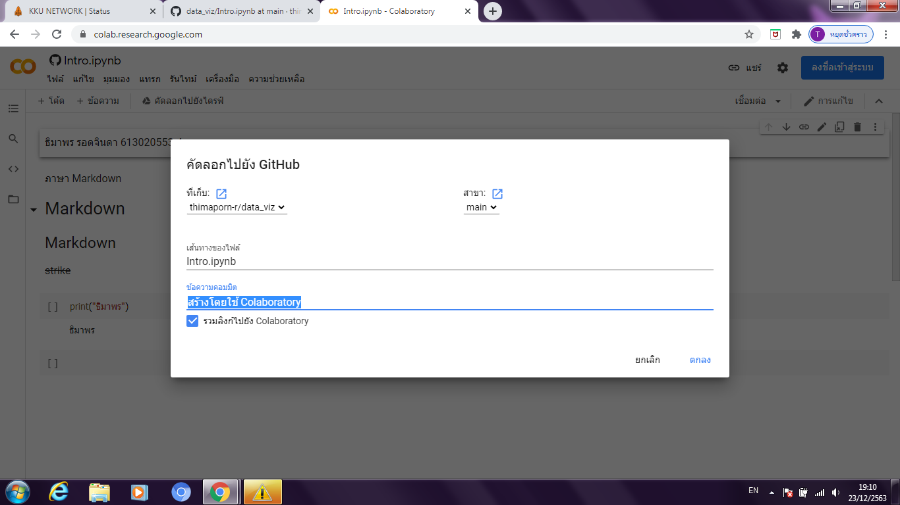
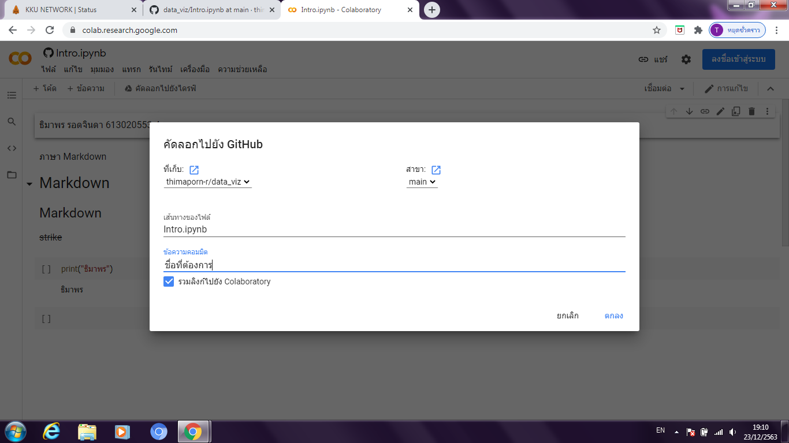
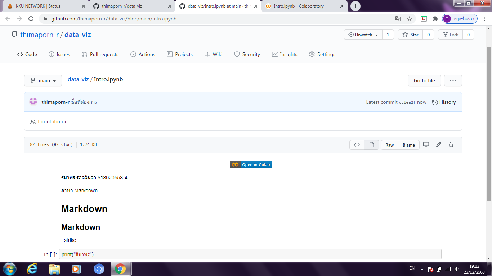

# data_viz
# ธิมาพร รอดจินดา 613020553-4

/////

Homework 1
วิธีการบันทึกไฟล์จาก Google Colab ใน GitHub
1. เมื่อใส่ข้อมูลเสร็จแล้ว ให้ไปคลิกที่ ไฟล์ 

2. แล้วกดเลือก บันทึกสำเนาใน GitHub

3. เปลี่ยนชื่อข้อความคอมมิตได้ตามที่ต้องการ แล้วกด ตกลง

4.จากนั้นสามารถเข้าไปเช็คใน GitHub จะขึ้นดังภาพ

